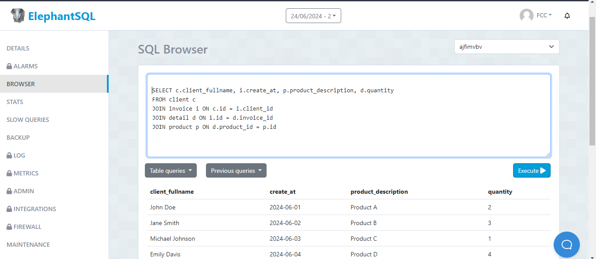
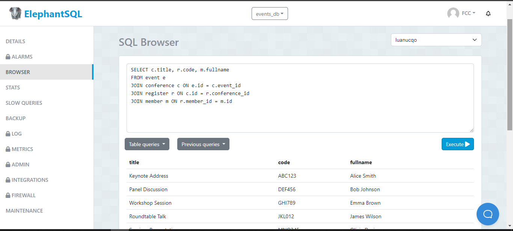

# TAS12 - views

## 1. Crear una vista que muestre la lista de productos comprados por los clientes con las siguientes columnas: 
           Base de datos: invoice
           nombre_cliente | fecha_compra | nombre_producto | cantidad
           
  - Sentencia:
  ```
SELECT c.client_fullname, i.create_at, p.product_description, d.quantity
FROM client c
JOIN invoice i ON c.id = i.client_id
JOIN detail d ON i.id d.invoice_id
JOIN product p ON d.product_id = p.id
  ```
  - Captura:


## 2. Crear una vista donde se muestre la lista de miembros registrados a las conferencias.
           Base de datos: event
           nombre_conferencia | codigo_registro | nombre_miembro 
           
  - Sentencia:
  ```
SELECT COUNT (*) AS products_total_computers
FROM product
WHERE category = 'Computers'
  ```
  - Captura:

